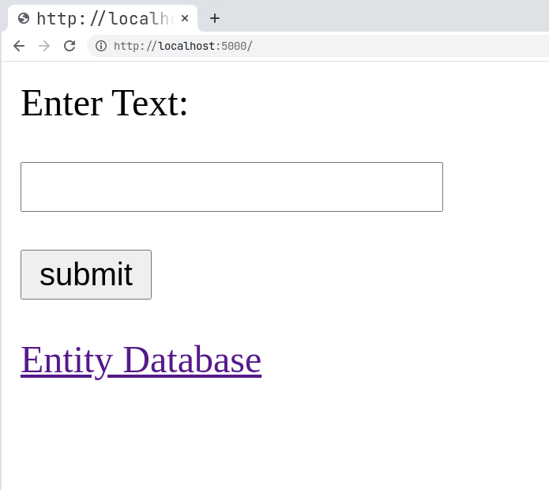
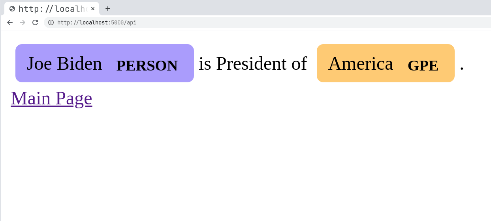
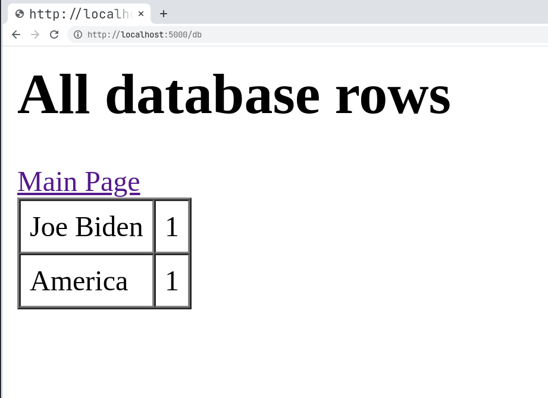

# CS138A Docker Assignment

This repo contains code for a named-entity recognition user interface and database, built on top of SpaCy, Flask, and SQLite. It also contains a Dockerfile to deploy in a container.

To run the main webserver, run `python app.py` and go to [https://localhost:5000](https://localhost:5000) in your browser.

To interact with the NER system, enter the string you want to query for named entities in the form on the main page and press "Submit". From there, you will see the extracted named entities, and a link to a database of the counts for all named entities the system has seen.

To build and run this repository as a docker container, execute:
```
sudo docker build -t nerdb .
sudo docker run --rm --publish 5000:5000 --name db nerdb
```
and go to [https://localhost:5000](https://localhost:5000) in your browser.

# Screenshots




